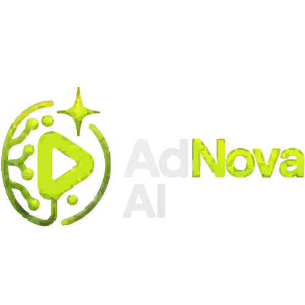

# 🚀 AdNova AI  
### 🎬 AI-Powered Advertisement Video Generation SaaS Platform

<p align="center">
  
</p>

<p align="center">
  <strong>Generate High-Converting AI Advertisement Videos in Minutes ⚡</strong>
</p>

---

<p align="center">


</p>

---

# 🌟 Overview

AdNova AI is a futuristic AI-powered SaaS platform that automatically generates professional advertisement videos using artificial intelligence.

Users simply:
- 📝 Enter product details
- 🖼️ Upload product images
- 🤖 AI generates advertisement scripts
- 🎙️ AI avatars create professional voiceovers
- 🎬 System renders final advertisement videos
- 📥 Export videos optimized for social media platforms

---

# ✨ Core Features

## 🤖 AI Advertisement Generation
- AI-powered marketing scripts
- Smart CTA generation
- Product-focused advertisement writing
- Multi-platform optimization

---

## 🎙️ AI Avatar Videos
- Talking AI avatars
- Natural AI voiceovers
- Human-like presentation videos
- Realistic advertisement generation

---

## 🎬 Video Rendering Engine
- Automated video composition
- Product overlays
- Subtitles & transitions
- Professional animation effects

---

## 📊 Dashboard System
- Video management
- User dashboard
- Analytics overview
- Credits monitoring
- Export management

---

## 👨‍💼 Admin Panel
- User analytics
- Revenue monitoring
- API monitoring
- Platform overview
- Credits tracking
- Usage analytics

---

## 🔐 Authentication & Security
- Clerk Authentication
- Protected routes
- JWT-based auth
- Role-based access control
- Secure API handling

---

# 🏗️ High-Level System Architecture

<p align="center">
  
</p>

---

## 🔥 Architecture Layers

| Layer | Responsibility |
|---|---|
| 👤 User Input Layer | Product details & image uploads |
| 🎨 Frontend Layer | Next.js dashboard & UI |
| ⚡ Backend Layer | Convex APIs & business logic |
| 🤖 AI Pipeline Layer | Gemini + HeyGen + Remotion |
| ☁️ Storage Layer | Media & generated video storage |
| 📦 Output Layer | Social media optimized exports |

---

# 🔄 End-to-End Workflow

<p align="center">
  
</p>

---

## ⚡ Workflow Steps

1. 👤 User enters product details
2. 🧠 Gemini AI generates advertisement script
3. 🎙️ HeyGen creates AI avatar & voice
4. 🎬 Remotion composes final advertisement
5. 📱 Multi-platform export optimization
6. 📊 Dashboard video delivery
7. 🚀 Final downloadable advertisement output

---

# 🧩 System Methodology Flowchart

<p align="center">
  
</p>

---

## 🛠️ AI SaaS Processing Methodology

- User Input Acquisition
- AI Script Generation
- Neural Voice Synthesis
- Avatar & Visual Generation
- Video Composition
- Multi-platform Adaptation
- Cloud Deployment
- Output Delivery

---

# ⚡ Tech Stack

| Category | Technology |
|---|---|
| Frontend | Next.js 14 |
| Styling | Tailwind CSS |
| Backend | Convex |
| Authentication | Clerk |
| AI Script Engine | Gemini AI |
| Avatar AI | HeyGen |
| Video Rendering | Remotion |
| Storage | Emergent Object Storage |
| Deployment | Vercel |

---

# 🎨 UI Showcase

## 🌐 Landing Page

<p align="center">
  
</p>

---

## 📊 User Dashboard

<p align="center">
  
</p>

---

## 👨‍💼 Admin Panel

<p align="center">
  
</p>

---

# 📂 Project Structure

```bash
adnova-ai/
│
├── src/
│   ├── app/
│   ├── components/
│   ├── actions/
│   ├── hooks/
│   ├── lib/
│   └── styles/
│
├── convex/
│
├── public/
│   ├── brand/
│   ├── assets/
│   └── icons/
│
├── docs/
│
└── README.md

📈 Future Improvements
🎙️ Voice cloning
🌍 Multi-language support
🤖 AI scene generation
💳 Subscription billing
📱 Mobile application
📊 Advanced analytics
🧠 AI campaign optimization
🛡️ Security Features
JWT Authentication
Clerk Session Security
Protected Admin Routes
Secure API Handling
Role-Based Access Control
Secure Media Uploads
👨‍💻 Developer
❤️ Built By
👑 Mohammad Raees

🚀 Full Stack Developer
🤖 AI SaaS Builder
🎨 UI/UX Enthusiast
🛡️ Future AI Engineer

🌟 Support

If you like this project:

⭐ Star the repository
🍴 Fork the project
🚀 Contribute improvements

📜 License

MIT License © 2026 AdNova AI

Permission is hereby granted, free of charge, to any person obtaining a copy of this software and associated documentation files to deal in the Software without restriction.

💡 Vision

AdNova AI is designed to simplify professional advertisement creation using AI automation and scalable SaaS architecture.

The platform combines:

Artificial Intelligence
Automation
Video Rendering
AI Avatars
Cloud Infrastructure
Modern SaaS Engineering

to help businesses generate high-quality advertisement videos faster than traditional workflows.

🔥 Why AdNova AI?

✅ AI-Powered Advertisement Creation
✅ SaaS-Based Modern Architecture
✅ Scalable Backend System
✅ Real-Time Dashboard
✅ AI Avatar Technology
✅ Multi-Platform Video Export
✅ Startup-Level UI/UX
✅ Production-Ready Project Structure

